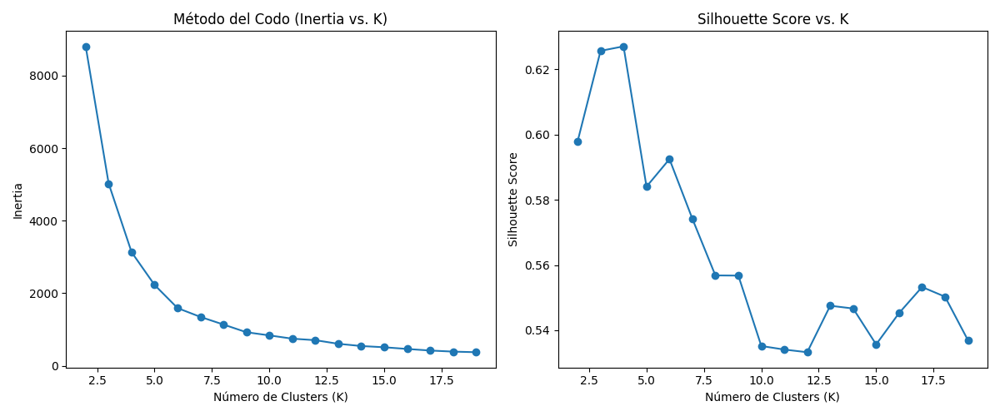
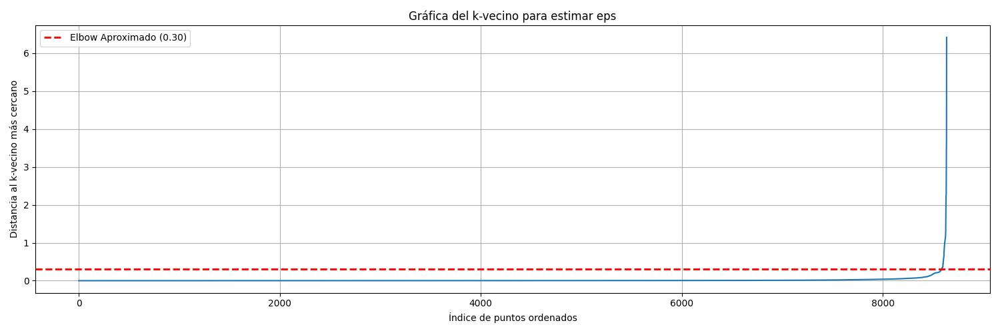
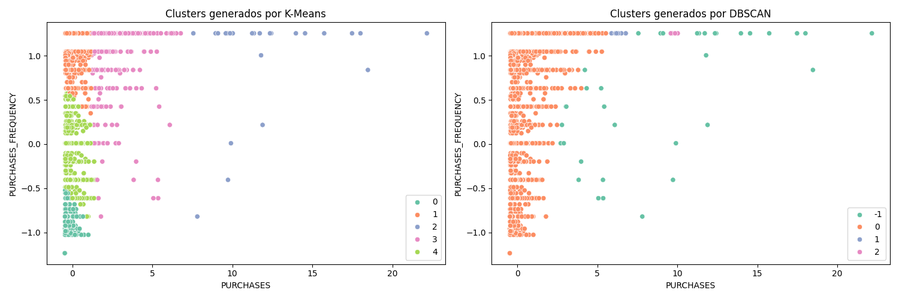

# Reporte de Resultados K-means y DBSCAN para agrupamiento de datos de tarjetas de crédito

Enlace al dataset: https://www.kaggle.com/arjunbhasin2013/ccdata

## Objetivo:

El objetivo es comparar la efectividad de K-means y DBSCAN en el dataset seleccionado, evaluando la cohesión e intersección de los clusters obtenidos mediante métricas de evaluación. Se espera que los estudiantes comprendan las diferencias entre ambos algoritmos y cómo usar las métricas adecuadas para elegir el mejor modelo de clustering.

## Variables seleccionadas para agrupamiento

Se seleccionaron las columnas:

- PURCHASES
- PURCHASES_FREQUENCY

El objetivo es buscar un agrupamiento entre montos de venta y frecuencia de compras, ya que son las métricas más relevantes para los emisores de las tarjetas de crédito.

## Análisis K-means:

Para el análisis de K-means, se usaron el método del codo y el silhouete score para determianr la mejor cantidad de grupos (K).

Del gráfico de codo y el silhouete score, podemos notar que el número de clusters K mas apropiado es K=5

## Análisis DBSCAN:

En este caso, se optó primeramente por utilizar la técnica de k vecinos en conjunto el método del codo para obtener el mejor epsilon con un min_samples=5

Se determinó que un valor bueno aproximado es 0.3

Luego, se buscó también la mejor combinación entre epsilon y min_samples con una grilla de parámetros. Los resultados fueron:

| Hiperparámetro | Valor |
| -------------- | ----: |
|  epsilon       |  0.48 |
| min_samples    |     4 |

## Métricas

### K-menas

| Métrica                 |    Valor |
| ----------------------- | -------: |
| Inercia                 |  2227.45 |
| Silhouette Score        |     0.58 |
| Davies-Bouldin Index    |     0.58 |
| Calinski Harabasz score | 14571.90 |

### DBSCAN

| Métrica                 |  Valor |
| ----------------------- | -----: |
| Silhouette Score        |   0.76 |
| Davies-Bouldin Index    |   3.00 |
| Calinski Harabasz score | 775.18 |

De los resultados, podemos notar:

- La técnica dbscan brinda un mejor silhouete score (más cercano a 1 mejor)
- La técnica dbscan brinda un menor davies bouldin index (más bajo mejor)
- La técnica dbscan brinda un menor Calinski Harabasz score (mas alto mejor)

## Gráficas comparativas

Considerando las métricas y las visualizaciones, DBSCAN parece ser la mejor opción para el clustering de PURCHASES y PURCHASES_FREQUENCY. Si bien, KMeans produce más agrupaciones, el método DBSCAN parece estar detectando más fácilmente datos de tipo outliers, lo que podría ser de gran utilidad para el proveedor de la tarjeta de crédito. Otra conclusión importante que se puede sacar con respecto a KMeans, es que los datos no necesariamente parecen estar tener forma circular, por lo que el KMeans no sería un método apropiado de clustering para estas columnas.
