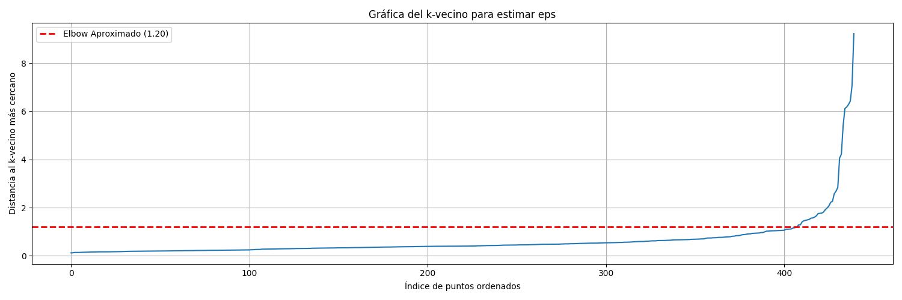

# Reporte de búsqueda de epsilon y min_samples para agrupamiento DBSCAN para wholesale-customers-data

## Búsqueda de Hiperparámetros

En este caso, se optó primeramente por utilizar la técnica de k vecinos en conjunto el método del codo para obtener el mejor epsilon con un min_samples=5. Se descartaron todos los resultados que no produzcan mas de 2 grupos junto al grupo de ruido.

A través de este método, se encontro un eps aproximado de 1.2.

Luego, se buscó también la mejor combinación entre epsilon y min_samples con una grilla de parámetros. Se descartaron todos los resultados que no superen más de 2 grupos junto al grupo de ruido.

La grilla comprendió los siguientes rangos:

| Hiperparámetro | Min | Max | Step |
| -------------- | --: | --: | ---: |
| eps            | 0.1 | 2.0 |  0.1 |
| min_samples    |   3 |  20 |    1 |

Los resultados fueron:

| Hiperparámetro | Valor |
| -------------- | ----: |
|  epsilon       |   1.4 |
| min_samples    |     3 |

## Análisis de resultados de agrupamiento con hiperparámetros encontrados

Al parecer, no parece haber una correlación muy fuerte. En este caso, la mayoría de los datos se agrupa en un solo grupo (cluster 0) y los elementos correspondientes al cluster 1 son bastante pocos. Los outliers se ven muy alejados de los datos principales, y son pocos en comparación al resto de los datos.

De estos datos, se puede determinar que DBSCAN no necesariamente es el mejor modelo de clustering para estos datos. Sólamente existe un cluster mayoritario (0) y uno pequeño (1) con el ruido en (-1). Se probaron diversos tipos de combinaciones en eps y min_samples, y a lo máximo que se pudo llegar es a 2 clusters. Esto solo se encontró ya que en la grilla de parámetros para DBSCAN explícitamente solamente se consideraron scores donde existía más de un cluster.

En el caso de los datos de tipo ruido, en los gráficos se pueden ver que generalmente están alejados de los datos principales. Adicionalmente, la cantidad es baja, por lo que no representa un riesgo muy alto para la empresa.

En el caso de los datos en el cluster 1, solamente existen 4 clientes. Debido a que en la búsqueda a través de la grilla solamente se consideraron resultados que den más de un grupo, es probablemente más que nada un caso muy específico resultante de los cálcuols y posiblemente correspondan de igual manera al grupo principal.

Según estos análisis, es probable que DBSCAN no sea el modelo más apropiado para este set de datos, ya que solamente es capaz de crear un clúster principal, siendo los otros clusteres muy pequeños y no representativos.
