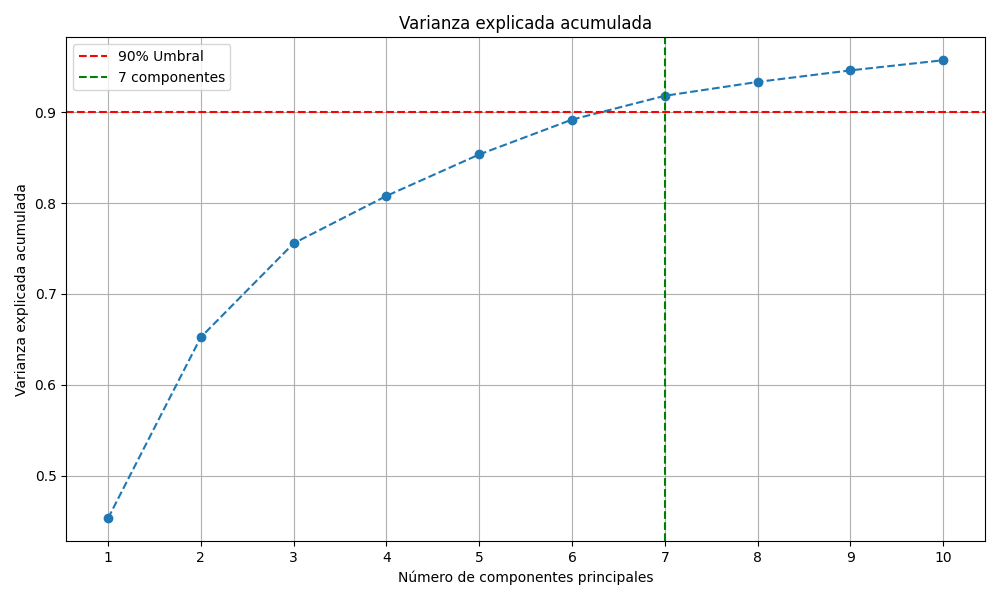
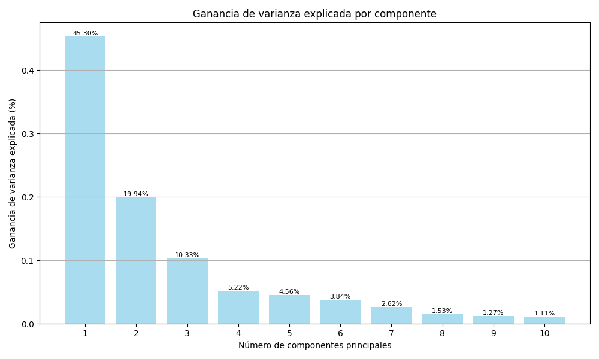
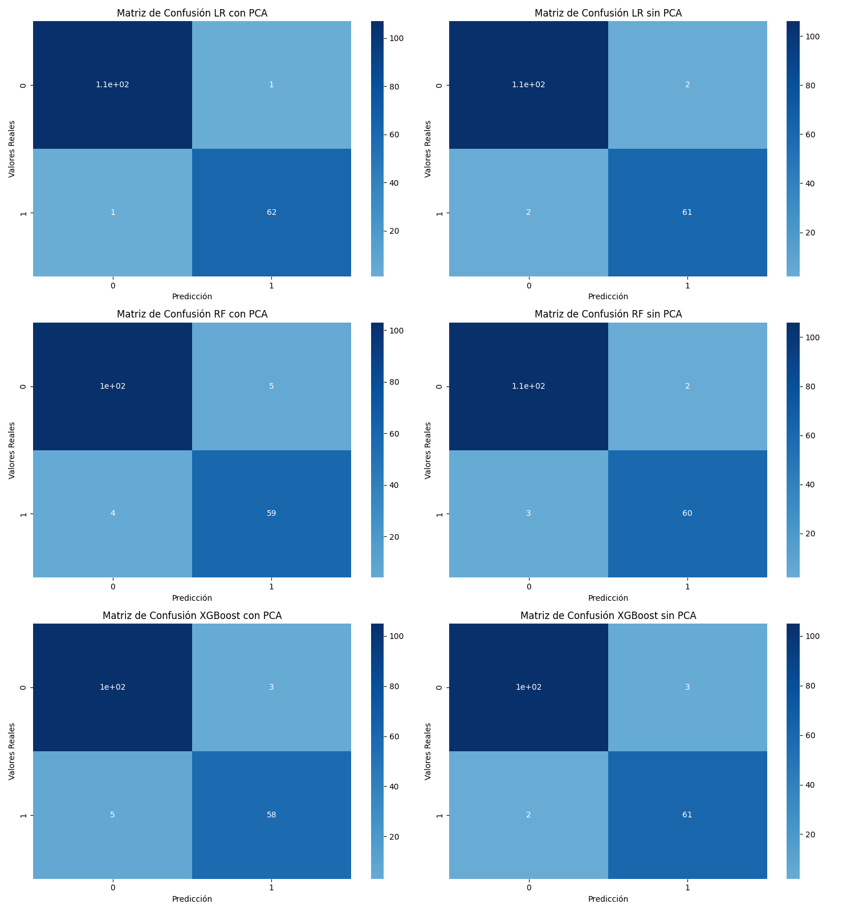

# Reporte Reducción de Dimensionalidad con PCA

Dataset elegido: https://www.kaggle.com/uciml/breast-cancer-wisconsin-data

A través de este reporte, se muestran los resultados de la utilización de PCA y sus efectos en los modelos de predicción.

## Análisis de reducción de dimensionalidad con PCA

Primero que nada, se eligió un número de componentes principales n_components=10, y en la búsqueda de retener al menos el 90% de la varianza explicada. Se aplicó el PCA y se obtuvieron los siguientes resultados:

### Varianza Explicada Acumulada

A través de este gráfico, se pudo notar que es posible retener el 90% de la varianza explicada acumulada en tan sólo 7 componentes, comparados a las 32 características disponibles.

### Ganancia de Vaianza Explicada Acumulada

En este gráfico, se visualizó la cantidad de varianza acumulada por cada componente. Notamos que los primeros tres componentes mantienen el 45.3%, 19.94%, y 10.33% de la varianza cada uno. Los siguientes componentes aportan cada vez menor varianza acumulada.

### Análisis comparativo de modelos

| --                          | Accuracy | Precision |   Recall | F1-Score |  ROC-AUC |
| --------------------------- | -------: | --------: | -------: | -------: | -------: |
| Regresión Logística con PCA | 0.988304 |  0.984127 | 0.984127 | 0.984127 | 0.998824 |
| Regresión Logística sin PCA | 0.976608 |  0.968254 | 0.968254 | 0.968254 | 0.997648 |
| Random Forests con PCA      | 0.959064 |  0.951613 | 0.936508 | 0.944000 | 0.993166 |
| Random Forests sin PCA      | 0.970760 |  0.983333 | 0.936508 | 0.959350 | 0.996767 |
| XGBoost con PCA             | 0.953216 |  0.950820 | 0.920635 | 0.935484 | 0.991182 |
| XGBoost sin PCA             | 0.970760 |  0.953125 | 0.968254 | 0.960630 | 0.994415 |

Mejores modelos por métrica:

| Métrica   |  Modelo                     |
| --------- | --------------------------- |
| Accuracy  | Regresión Logística con PCA |
| Precision | Regresión Logística con PCA |
| Recall    | Regresión Logística con PCA |
| F1-Score  | Regresión Logística con PCA |
| ROC-AUC   | Regresión Logística con PCA |

Matrices de confusión:

### Conclusiones

De las métricas, podemos destacar lo siguiente:

- En el caso de la Regresión Logística, el modelo se beneficia con la reducción de dimensionalidad. Esto se puede deber a que un modelo como la regresión logística es un modelo lineal, en donde las correlaciones son importantes, y el PCA ayuda al modelo a enfocarse solo en las características con más correlaciones.
- En el caso de Random Forests, el modelo pierde rendimiento aplicando la reducción de dimensionalidad. Como este modelo no es un modelo lineal, posiblemente la pérdida de datos ocasionada por el PCA influya en el rendimiento.
- En el modelo XGBoost, el modelo también pierde rendimiento. Al no ser un modelo lineal basado en árboles, posiblemente no sea el mejor modelo para aplicar PCA.

De todos los resultados, la regresión lineal es la que más se beneficia de aplicar PCA. Adicionalmente, este modelo es el mejor en todas las métricas.

Se puede notar una leve disminución de rendimiento en los modelos de Random Forests y XGBoost, no obstante no es muy grande y se puede explicar teniendo en cuenta que el PCA beneficia más a modelos de tipo lineal.
