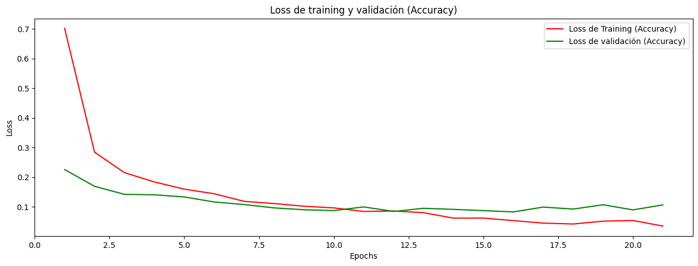
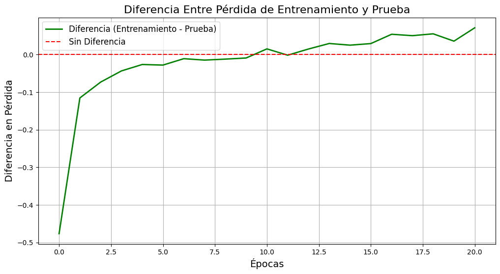
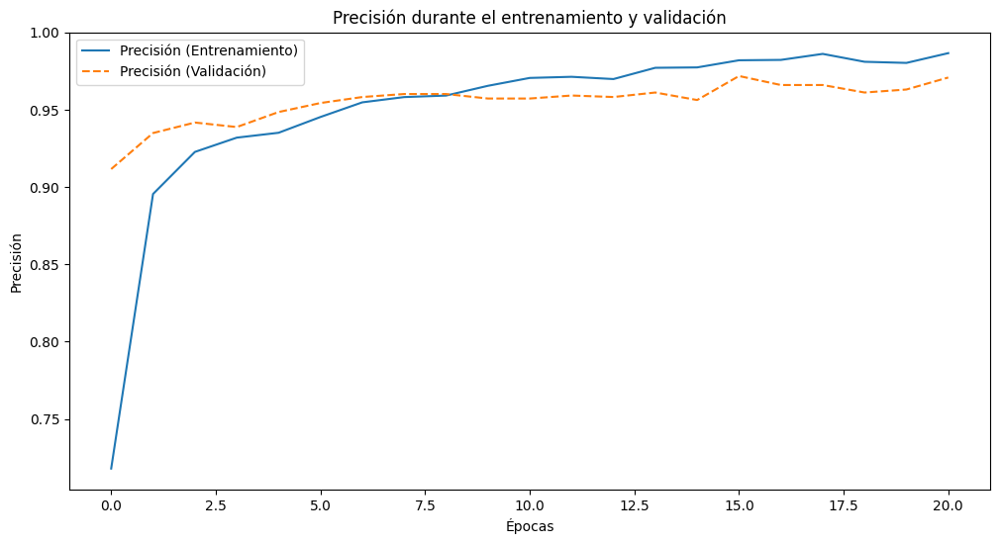

# Reporte Examen Ceritificación 1 - Human Activity Recognition

Este reporte contiene los resultados de los análisis y evaluación de modelos implementados sobre el dataset Human Activity Recognition, como parte de la resolución del examen.

## Exploración y procesamiento de datos

En este paso, se realizó lo siguiente:

- Se descargó el dataset y se analizaron los datos que contiene
- Se verificó que no existían valores nulos que manejar
- No se encontraron valores duplicados
- Se detectó que los datos ya estaban potencialmente normalizados, pero se optó de igual manera probar el PCA con técnicas de escalamiento
- No se detectaron desbalanceos significativos en los datos que pudieran causar sesgos tanto en el PCA como en el MLP. Esto se puede visualizar abajo.

## Análisis no supervisado

Se seleccionó la técnica de PCA. Se decidió realizar el train_test_split previo al análisis, ya que se puso como objetivo usar la salida del PCA como entrada para el la red neuronal a implementarse despues o la MLP.

### Búsqueda de número de componentes principales

Primeramente, se realizó una búsqueda del número de componentes que permitan mantener el 90% de la varianza. Se utilizaron las siguientes técnicas de escalamiento:

- Sin Escalamiento
- Normalización (MinMaxScaler)
- Estandarización (StandardScaler)
- RobustScaler

Se pueden visualizar los resultados en el gráfico de abajo.

De este análisis se sacaron las siguientes conclusiones:

- En el caso de no utilizar escalamiento, se puede retener el 90% de la varianza explicada utilizando 34 componentes.
- Usando la normalización como técnica de escalamiento (MinMaxScaler), se logra retener el 90% de la variaza usando 35 componentes.
- Usando la estandarización como técnica de escalamiento (StandardScaler), se logra retener el 90% de la varianza usando 63 compoenntes.
- Finalmente, usando la técnica de escalamiento RobustScaler, se logra retener el 90% de la varianza explicada usando 35 componentes.

### Análisis de Ganancias de varianza por componente

También, se graficaron las ganancias de las varianzas explicadas por componente. Este gráfico se encuentra abajo:

De estos gráficos de varianza explicada por componente podemos destacar:

- Para la varianza explicada por componente sin escalamiento:
  - El primer componente es el que más varianza explicada posee, con un 62.48% de varianza explicada acumulada
  - El segundo y tercer componente ya empiezan a proveer menos varianza, solamente alcanzando 4.92% y 4.16% respectivamente
  - Los demas componentes ya empiezan a proveer cada vez menos varianza
- Para la varianza explicada por componente con normalización (MinMaxScaler):
  - Se ven resultados muy similares a los resultados anteriores
  - El primer componente logra capturar 62.24% de la varianza.
  - El segundo y tercer componente acumulan 5.08% y 4.17% de la varianza respectivamente
  - Los demas componentes proveen ya menor varianza
- Para la varianza explicada por componente con estandarización (StamdardScaler):
  - Se verifican resultados un poco diferentes a las técnicas anteriores
  - El primer componente sigue manteniendo la mayor cantidad de varianza explicada, aunque el porcentaje disminuyó al 50.72%
  - El segundo componente logra mantener el 6.60% de la varianza explicada
  - En los siguientes componentes ya se empieza a notar una disminución en varianza explicada acumulada.
- Para la varianza explicada por componente con RobustScaler:
  - Se sigue reteniendo la mayor cantidad de la varianza en el primer componente, no obstante el porcentaje es drásticamente menor que en las técnicas anteriores, siendo sólo del 30.5%.
  - El segundo componente logra mantener una varianza explicada del 6.06%
  - Los componentes siguientes logran retener más cantidad de varianza comparado a las otras técnicas de escalamiento, aunque de igual manera los porcentajes son bajos en comparación al componente 1.
- De los 4 gráficos podemos destacar, que existe un componente bastante predominante y otros componentes que retienen menor varianza explicada. Esto nos indica que los valores medidos por los sensores están en gran parte relacionados, y la técnica de PCA está extrayendo estas relaciones en componentes independientes, lo que resulta en un solo componente acaparando la mayor cantidad de varianza. Esto se podría explicar teniendo en cuenta que los sensores miden variables que están de una u otra manera relacionados. Por ejemplo, la aceleración, velocidad, posición, rotación.

### Proyección de datos en el espacio de componentes principales.

Se visualizaron también los datos proyectados en el espacio de los componentes principales. Estos se pueden visualizar en la gráfica:

De los gráficos podemos destacar:

- En el caso del gráfico de dispersión sin escalamiento y en el de dispersión con normalización, podemos notar dos agrupamientos de los componentes:
  - El primer grupo muestra una correlación ascendente. Es decir, a medida que incrementa el componenet principal 1, también incrementa el componente principal 2.
  - El segundo grupo muestra una correlación descendente. Es decir, a medida que aumenta el componente principal 1, el segundo disminuye.
  - Estas relaciones podrían también ser detectadas por un modelo predictivo, así que es bueno que existan. No obstante, será necesario introducir al modelo de prediccion no linealidad para que pueda detectar este cambio en la dirección de las correlaciones.
- En el Gráfico de Disperción con estandarización, podemos notar dos agrupamientos:
  - El primer grupo muestra una correlación descendente. Es decir, a medida que aumenta el componente principal 1, el segundo disminuye.
  - El segundo grupo muestra una correlación ascendente. Es decir, a medida que incrementa el componente principal 1, el segundo aumenta también.
  - De manera similar al caso anterior, las relaciones podrían tener un efecto positivo en el modelo de predicción, pero hay que agregar activaciones no lineales al modelo MLP a entrenar.
- En el último gráfico, podemos notar que inicialmente se ve una correlación, no obstante, a medida que incrementa el componente principal 1, incrementa la dispersión, lo cual indica una corelación fuerte al principio pero que va volviéndose más debil.

### Análisis de contribuciones de las columnas a las componentes principales

Se realizó un análisis de las columnas que contribuyen más a cada componente principal. Los resultados de este análsis son los siguientes:

- En el caso del PCA sin escalamiento:
  - Para el componente principal 1, los datos más influyentes son: fBodyAccJerk, fBodyAcc, fBodyAccMag. Estos parámetros son indicadores de movimiento, por lo que el movimiento se está capturando en este componente.
  - Para el componente principal 2, los datos más influyentes son fBodyAcc, fBodyGyroMag. En este caso, en este componente se está capturando tanto partes de la aceleración como la orientación del cuerpo.
- En el caso del PCA con normalización:
  - Para el componente principal 1, los datos más influyentes son: fBodyAccJerk, fBodyAcc, fBodyAccMag. Estos parámetros son indicadores de movimiento, por lo que el movimiento se está capturando en este componente.
  - Para el componente principal 2, vuelven a aparecer partes de fBodyAcc y fBodyGyroMag, con la adición de fGravityAcc. Esto indica que en este componente influye también bastante la gravedad, a diferencia del PCA sin escalamiento.
- En el caso del PCA con estandarización:
  - Para el componente principal 1, los datos más influyentes son: fBodyAcc, fBodyAccJerk, fBodyGyro. Esto nos indica que en este componente se están capturando partes de tanto la aceleración como la orientación.
  - Para el componente principal 2, vuelven a aparecer partes de fBodyAcc y fBodyGyroMag, con la adición de fGravityAcc. También podemos visualizar efectos de la gravedad en este componente.
- En el caso del PCA con escalamiento Robust:
  - En la componente principal 1, los datos más influyentes son: fBodyAccJerk, fBodyGyro. Por tanto, en este componente también se están capturando datos de aceleración y orientación.
  - En la componente principal 2, se puede visualizar de vuelta fBodyAccJerk, fBodyGyro, y tGravityAcc. También notamos una leve influencia de la gravedad en este componente.

## Modelado con MLP

### Implementación de Modelo MLP y Métricas

Se optó por usar el PCA probado previamente para el entrenamiento de este modelo. Se tomaron las siguientes decisiones previos a la implementación y prueba del modelo:

- Se necesitarán 34 entradas, que provendrán de la conversión del PCA.
- Se necesitarán 6 salidas, que corresponden a cada clase a ser predicha.
- Se agregarán dos capas a la red neuronal, una de 64 entradas y otra de 32, las dos con activación de tipo relu para introducir no linealidad al modelo de acuerdo a lo visto en las gráficas de dispersión del PCA.
- Se agregará un dropout a la salida de cada capa con el objetivo de evitar overfitting.
- Se usará categorical_crossentropy como función de pérdida para el modelo. Esta función de pérdida es usada específicamente para modelos de clasificación multi clase.
- Se usará accuracy como métrica principal, con el objetivo de predecir correctamente la mayor cantidad de clases.
- Se usara Adam como optimizador para la búsqueda de los mínimos.
- Se seleccionará learning_rate como 0.001 para. Este valor debe ser bajo para alcanzar un buen mínimo. Este valor no debe ser muy alto para permitir al Adam
- Se seleccionará un batch_size de 16, pequeño, ya que el learning_rate seleccionado es bajo para este modelo.

Adicionalmente, se agregó la técnica de early_stopping, que monitorea la pérdida de validación del accuracy.

Se utilizaron los datos de entrenamiento y prueba que fueron utilizados previamente para el análisis PCA.

## 4. Evaluación del modelo:

### Evaluación de rendimiento del modelo en datos de test.

Se realizaron cálculos de métricas como accuracy, precision, recall, f1 score, roc auc. Los resultados son los siguientes:

| Métrica   | Valor |
| --------- | ----: |
| Accuracy  |  0.96 |
| Precision |  0.96 |
| Recall    |  0.96 |
| F1        |  0.96 |
| ROC AUC   | $1.00 |

Se realizó también un reporte de clasificación, que dió los siguientes resultados:

| precision          | recall | f1-score | support |
| ------------------ | -----: | -------: | ------: | ---- |
| LAYING             |   1.00 |     1.00 |    1.00 | 428  |
| SITTING            |   0.94 |     0.89 |    0.92 | 386  |
| STANDING           |   0.90 |     0.94 |    0.92 | 411  |
| WALKING            |   0.98 |     1.00 |    0.99 | 366  |
| WALKING_DOWNSTAIRS |   0.98 |     0.98 |    0.98 | 311  |
| WALKING_UPSTAIRS   |   1.00 |     0.98 |    0.99 | 304  |
| accuracy           |        |          |    0.96 | 2206 |
| macro avg          |   0.97 |     0.96 |    0.97 | 2206 |
| weighted avg       |   0.96 |     0.96 |    0.96 | 2206 |

También, se obtuvo la matriz de confusión:

Se graficaron las curvas ROC-AUC usando la técnica One vs. Rest:

De estos resultados, se sacaron las siguientes conclusiones:

- Las métricas como accuracy, precision, recall, f1 score poseen todas un valor promedio de 0.96. Un valor bastante alto, indicando que el modelo MLP es un buen modelo para predecir las actividades de las personas en base a los sensores.
- La métrica ROC AUC reporta un valor approx de 1.00, lo que indica que el modelo tiene una muy buena tasa de aciertos.
- Del reporte de clasificación, podemos notar que la mayoría de las clases tienen un buen performance en métricas como precision, recall, f1-score, con la excepción de las clases SITTING y STANDING, que tienen métricas como precision, recall, f1-score un poco mas bajos que las demás clases.
- La matriz de confusión del modelo nos indica, al igual que la conclusión anterior, que el modelo está teniendo un performance levemente menor para las clases SITTING y STANDING, teniendo 50 fallos para la clase SITTING que fueron predichos como STANDING, y 29 fallos para la clase STANDING que fueron predichas como SITTING.
- Las curvas ROC AUC one vs rest también nos indican que el modelo tiene un peor performance en estas clases. Para las otras, las areas AUC oscilan entre 0.98 y 1.00
- Esto nos indica, que este modelo no tiene problema en detectar actividades de movimiento, no obstante se encuentran más fallos para las classes en la que la persona no se está moviendo.

### Visualización de curvas de aprendizaje.

Para evaluar las mejoras del modelo a lo largo del tiempo, se graficó primeramente la evolución del accuracy a medida que se entrenaba el modelo:

Se graficó también la diferencia entre la pérdida de entrenamiento y validación:

También, se evaluó la precisión del modelo a través de las épocas:

De estos gráficos de training y validación podemos destacar:

- Inicialmente se puede visualizar una pérdida bastante alta en el accuracy, pero que va reduciéndose a medida que pasan más épocas de entrenamiento
- En el caso de la pérdida de validación, se visualiza que dicha perdida se mantiene estable alrededor de los 0.1-0.2
- Notamos también que hay una menor pérdida en la validación en las primeras épocas. Esto se nota tanto en los gráficos de pérdidas como en la diferencia. Esto se puede deber a que las capas de dropout causan que ciertas neuronas estén apagadas durante el entrenamiento, lo que puede llevar a que la pérdida de entrenamiento sea menor a la de validación inicialmente.
- La época en la que la la pérdida de validación empieza a crecer es en la 10.
- No se puede visualizar un incremento repentino en la pérdida de validación, por lo que el modelo está detectando los patrones correctos. Esto también nos indica que el modelo no está presentando overfitting.

## 5. Discusión y análisis:

### Análisis de componentes principales (PCA):

En el PCA, notamos que efectivamente hay una gran influencia sobre parámetros como la aceleración y la orientación del cuerpo. Estos parámetros permiten determinar el tipo de actividad física que la persona está realizando.

Los parámetros encontrados que más influencian los componentes principales 1 y 2 son:

- Para el componente principal 1, los datos más influyentes son: fBodyAccJerk, fBodyAcc, fBodyAccMag. Estos parámetros son indicadores de movimiento, por lo que el movimiento se está capturando en este componente.
- Para el componente principal 2, los datos más influyentes son fBodyAcc, fBodyGyroMag. En este caso, en este componente se está capturando tanto partes de la aceleración como la orientación del cuerpo.

El PCA también ayuda al entrenamiento de los modelos reduciendo las dimensiones de los datos de entrada, reteniendo la información más importante para el modelo. Esto permite un tiempo de entrenamiento más reducido, y un menor uso de memoria.

### Modelo Perceptrón Multicapa

Según las métricas como el accuracy, precision, recall y f1-score, este modelo es definitivamente una buena opción para la predicción de actividades de las personas. No obstante, el modelo tiene mayores dificultades para detectar correctamente las actividades como: STANDING y SITTING. De igual manera, para estas clases las métricas no son malas, sino mas bien con métricas un poco menores, pero de igual manera tienen buen rendimiento.

Este modelo podría mejorarse agregando más capas, y probando con un PCA que capture una mayor cantidad de varianza explicada, ya que la varianza explicada actualmente es del 90%. Tal vez el incremento de esta varianza explicada permita al modelo detectar mejor las clases STANDING y SITTING.
