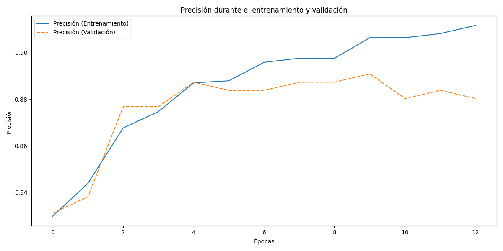

# Reporte Examen Ceritificación 2 - Customer Personality Analaysis

Este reporte contiene los resultados de los análisis y evaluación de modelos implementados sobre el dataset Customer Personality Analysis, como parte de la resolución del examen.

## Exploración y preprocesamiento de datos

En este paso, se realizó primeramente un preprocesamiento de los datos

- Se descargó el dataset y se analizaron los datos que contiene
- Se convirtieron las columnas a su tipo correcto
- Se verificaron valores nulos en la columna Income:
  - Se evaluó la posibilidad de imputar estos valores nulos con modelos predictivos, con resultados no tan buenos.
  - Finalmente, se optó por eliminarlos del dataset, ya que son muy pocos (24, un 1.07%)
- Se verificaron outliers improbables en las columnas como Income y Year_Birth, eliminándolas cuando no correspondían.
- Se detectaron y eliminaron valores duplicados que puedan causar sesgos, tanto en la visualización como los modelos de predicción.
- Se visualizaron las estadísticas descriptivas, tanto de las columnas numéricas como las categóricas.
- Se analizaron los outliers y su proporción respecto al total.

## EDA

### Histogramas

De los histogramas podemos destacar:

- Year_Birth: La mayoría de los clientes en el dataset nacieron entre 1940 y 2000, sugiriendo que tienen como mínimo la edad de 24 años, y un máximo de 84 años a fecha de 2024.
- Income: los datos están mas concentrados entre 30.000-40.000.
- Las columnas de hijos poseen distribuciones normales, siendo 2 hijos la menor cantidad en ambos casos.
- Recency parece tener una distribución muy equitativa.
- Las columnas de montos de gasto (MntWines, MntFruits, etc) muestran una distribución muy concentrada en los precios mas económicos, reduciéndose de a poco a medida que incrementa el precio. Estos precios más altos pueden interpretarse como outliers, y se verificarán luego con los boxplots.
- En la columna NumDealsPurchases, podemos notar que la mayoría de los clientes toman hastas 4 ofertas como máximo, siendo mas raro que tomen más.
- En la columna NumWebPurchases, notamos que hay un rango un poco más distribuído hasta approx. 8 compras online.
- En la columna NumCatalogPurchases, notamos que la mayoría de clientes realizan a lo sumo hasta 5 compras del catálogo
- En la columna NumStorePurchases, notamos que las compras están mejor distribuidas en comparación a NumWebPurchases y NumCatalogPurchases, visualizando que la mayoría de clientes compran en el rango de 3 a 5 compras approx.
- La columna NumWebVisitsMonrth indica que la mayoría de clientes visita a lo sumo hasta 10 veces el sitio web, verificándose también potenciales outliers superiores.

### Boxplots

De los boxplots podemos destacar:

- No se encuentran outliers en la columna Year_Birth. Esto es importante ya que nos indica que la distribución de edades es correcta en el dataset.
- En las columnas de monto gastado, se visualiza una gran cantidad de outliers.
- También se pueden visualizar outliers, aunque en menor medida, en las columnas NumDealsPurchases, NumWebPurchases, NumCatalogPurchases, NumWebVisitsMonth.
- Las columnas Kidhome y Teenhome presentan una mediana (Q2) no centrada, indicando que hay una mayor cantidad de clientes con menor cant. de hijos con respecto al máximo de 2.
- También se vizualiza en los datos de montos gastados que la mediana no está centrada

Estas visualizaciones refuerzan la necesida de implementar técnicas de escalamiento robustas ante outliers, como el RobustScaler de Scikit Learn. Esta técnica de escalamiento se utilizará al momento de entrenar los modelos, usando pipelines, en vez de escalar las características aquí. Se opta por escalar en la sección de modelado ya que el escalamiento solo se calculará con datos de entrenamiento y no con datos de test, evitando sesgos que provengan en los datos de prueba.

### Gráficos de Barra

Podemos notar en los gráficos de barra:

- En el caso de Marital_Status, la gran mayoría de clientes se concentra en las categorías married, single, together, siendo married el que mayor cantidad tiene
- En el caso de Education, se puede visualizar que la mayoría de clientes en el dataset cuenta con educación como mínimo universitaria.
- En la columna objetivo Response, podemos notar que efectivamente existe un gran desbalanceo en los datos, siendo False la respuesta mayoritaria frente a True. Esto se debe tener en cuenta al momento de realizar el modelado.

### Gráficos de Barra contra Response

De estos gráficos de barras podemos resaltar:

- La categoría en Marital_Status que más cantidad de respuestas positiva tiene es la single, indicando que las promociones funcionan mejor con esta categoría de clientes.
- También, podemos notar una mayor cantidad de clientes graduados que indican una respuesta positiva a la promoción.
- Finalmente, se visualiza que hay muy pocas respuestas positivas en clientes que no cuentan con educación universitaria.

### Mapas de Correlaciones

Se graficó un mapa de correlación de pearson, en busca de correlaciones de variables numéricas:

Del mapa de correlación, podemos notar las siguientes relaciones:

- Columnas como MntWines, MntFruits, MntMeatProducts, MntFishProducts, MntSweetProducts, y MntGoldProds, muestran una correlación alta con la columna Income. Esto se interpreta como que los clientes tienen tendencias de gastos acordes a sus ingresos.
- También se puede visualizar una tendencia similar en columnas como NumDealsPurchased, NumWebPurchases, NumCatalogPurchases, NumStorePurchases. La cantidad de compras por parte de clientes está relacionada con sus ingresos.
- También, se detecta una correlación negativa importante entre la columna Income vs la columna Kidhome.
- Se puede visualizar también una correlación negativa en la columna Kidhome vs los campos de cantidad de gasto y cantidad de compras en los diversos tipos de productos. Esto nos indica que la cantidad de hijos impacta en los comportamientos de compra por parte de los clientes.

También, se graficó el mapa de correlación de punto biserial con respecto a Response:

Notamos las siguientes correlaciones:

- Income
- Kidhome
- Teenhome
- MntWines
- MntFruits
- MntMeatProducts
- MntFishProducts
- MntSweetProducts
- MntGoldProds
- NumDealsPurchases
- NumWebPurchases
- NumCatalogPurchases
- NumStorePurchases
- NumWebVisisMonth

De igual manera, estas correlaciones no son muy fuertes, todas menores a 0.7.

## Análisis no supervisado

Para esta sección, se opta por la técnica de clustering KMeans. Se opta por usar todos los datos excepto Response. Si bien, este dataset no parece estar pensado para modelos de aprendizaje supervisados, esta variable se utilizará luego para entrenamiento del modelo a modo de ejemplo de implementación.

### Preprocesamiento

Previo a la aplicación de la técnica KMeans, se seleccionaron variables como:

- Income
- MntSpent
- NumPurchases

Se eligieron estas columnas ya que el algoritmo de KMeans usa la distancia como métrica para agrupamiento, y columnas convertidas a través de one-hot o OrdinalEncoder no serían buenas para el agrupamiento a menos que se encuentre una manera muy específica de asignarles un valor numérico.

Adicionalmente, se escalaron las características usando RobustScaler. Se optó por este tipo de escalamiento, ya que existen muchos outliers en el dataset, por lo que es importante que el escalado tome en cuenta esto. El RobustScaler es la mejor opción para este tipo de datos.

### Búsqueda de mejor número de clusters

Se buscó el mejor K en el rango de 2 a 11 clústeres, usando el método del codo y el Silhouete Score.

De los gráficos de codo y Silhouete Score, podemos destacar:

- En el gráfico de codo, podemos notar que el nro. de clusters óptimos está en 3.
- En el gráfico de Silhoute score, el máximo valor alcanzado es approx 0.52. No obstante, con este silhouete score solo se crean dos clusters.

De ambos gráficos, podemos determinar que el mejor número de clusters para esta tarea es de 3, ya que el método del codo nos da este valor, y el mejor silhouete score solo nos genera dos grupos, lo cual significaría que los clientes no estarían lo suficientemente bien segmentados.

### Visualizaciones en 2D

#### Clústers en columnas Income y MntSpent

En este gráfico podemos ver los tres clústers generados por KMeans. Se puede resaltar lo siguiente:

- El primer grupo, en color verde, es el grupo en el que los ingresos son los más bajos.
- En el segundo grupo, podemos notar que incrementan los ingresos, y también la cant. gastada incrementa
- En el tercer grupo, notamos otro incremento en los rangos de ingresos, aunque la cantidad gastada incrementa mucho más rápidamente que los ingresos.
- Podemos visualizar que los grupos se van dividiendo más de acuerdo a la cantidad gastada antes que los ingresos.

#### Clústers en columnas Income y NumPurchases

En este gráfico de dispersión, podemos ver lo siguiente:

- El Cluster 1 es el que aglomera los clientes con menor cant. de ingresos.
- Se puede visualizar en los gráficos, que el clúster 1 está bien separado de los otros 2, pero los clústers 0 y 2 están bastante cerca, lo que lleva a concluír que en estos ejes hay un poco de solapamiento, a diferencia de en el gráfico anterior.

#### Clusters en columnas NumPurchases y MntSpent

En este gráfico de dispersión podemos notar lo siguiente:

- Los tres clústers están bien separados.
- En el cluster 1, podemos notar como incrementa el gasto conforme incrementa el número de compras.
- En el cluster 0, podemos notar que la cantidad gastada también incrementa el número de compras, aunque hay una mayor dispersión en este caso, y la cantidad gastada crece mas rápido que el número de compras.
- En el cluster 2, podemos notar que hay una mayor cantidad de gasto, pero el rango de cantidad de compras se mantiene similar al del cluster 0.

### Visualización de Clusters en 3d

De los gráficos 3D y las otras gráficas podemos notar:

- Se forman los tres clusters, que en este caso parecen estar bien agrupados.
- Podemos notar que a medida que incrementan los ingresos, también incrementa la cantidad gastada.
- El clúster 1 está bien separado del resto en todos los ejes.
- Los clústers 2 y 3 están solapados en el eje de Income, pero se nota la separación en el eje de la cantidad gastada, en la que a medida que incrementa la cantidad gastada también incrementa.

De todos los resultados, podemos concluír lo siguiente:

- La mejor K para estos datos es de K=3.
- Con esta K, se crean 3 grupos:
  - Cluster 1: El grupo de clientes que tiene menores ingresos y gasta menos.
  - Cluster 0: El grupo de clientes que gana más pero no necesariamente gasta mucho más.
  - Cluster 3: El grupo de clientes que gana más y también gasta más. Adicionalmente, estos clientes tienden a gastar más en productos particulares en vez de hacer muchas compras.
- Estos grupos nos indican que efectivamente el agrupamiento es efectivo en detectar grupos de clientes que hacen sentido de negocio, y por lo cual, es una técnica válida para este problema.

## Modelado con MLP

Para esta sección, se opta por buscar si es que un cliente aceptará una oferta en una campaña publicitaria. Esto se decidió debido a que no existe un campo que indique el tipo de producto vendido en el dataset. Con este acercamiento, se pretende dar una idea a la compañía de si la persona responderá positivamente a cierta campaña publicitaria, en base a sus datos y el aceptamiento de campañas previas.

Adicionalmente, se consideró también la posibilidad de realizar un feature engineering para agregar el tipo de producto que más probablemente compre el cliente, o utilizar los resultados de KMeans, para crear features relacionadas a productos a ser predichas, pero finalmente se optó por no implementar este tipo de feature engineering para variables objetivo. Esto se debe a que por lo general el feature engineering se basa en asumpciones en los datos que pueden llevar a correlaciones, lineales o no. Estas correlaciones serían fácilmente detectadas por los modelos de predicción, por lo que al final se estaría prediciendo un feature que ya tiene una relación con otras características, llevando a un rendimiento potencialmente alto.

### Preprocesamiento

Para el preprocesamiento, se tuvo en cuenta lo siguiente:

- Se deben convertir las columnas booleanas a numéricas, para que tensorflow pueda trabajar con estos datos.
- Se deben convertir las columnas categóricas usando o OneHotEncoder o OrdinalEncoder, dependiendo de si estas variables categóricas poseen un orden o no.
- Se deben escalar las columnas numéricas, para mejorar el rendimiento del modelo MLP, incrementar la velocidad de convergencia, y mantener la estabilidad durante el entrenamiento.

### Implementación del modelo MLP

Se implementó el modelo con las siguientes consideraciones:

Creamos el Modelo Perceptrón Multicapa (MLP) con las siguientes consideraciones:

- Se necesitarán 18 entradas, que provendrán de la salida del preprocesador.
- Se necesitará 1 salida, la probabilidad de aceptación o no.
- Se agregarán dos capas a la red neuronal, una de 64 entradas y otra de 32, las dos con activación de tipo relu para introducir no linealidad al modelo.
- Se agregará un dropout a la salida de cada capa con el objetivo de evitar overfitting.
- Se usará binary_crossentropy como función de pérdida para el modelo. Esta función de pérdida es usada específicamente para modelos de clasificación binarias.
- Se usará accuracy como métrica principal, con el objetivo de predecir correctamente la mayor cantidad de muestras correctamente.
- Se usara Adam como optimizador para la búsqueda de los mínimos.
- Se seleccionará learning_rate como 0.001 para. Este valor debe ser bajo para alcanzar un buen mínimo con el optimizador.
- Se seleccionará un batch_size de 16 para empezar. En caso de que el rendimiento sea bajo, se puede optar por incrementar este parámetro, teniendo en cuenta que también se deberá ajustar learning_rate en el optimizador Adam.
- Se utilizará la técnica de early stopping para detectar cuando la pérdida de validación ya no baja, disminuyendo la posibilidad de overfitting.

### Visualización de curvas de aprendizaje.

Para evaluar las mejoras del modelo a lo largo del tiempo, se graficó primeramente la evolución del accuracy a medida que se entrenaba el modelo:

Se graficó también la diferencia entre la pérdida de entrenamiento y validación:

También, se evaluó la precisión del modelo a través de las épocas:

De estos gráficos de pérdida en training y validación podemos destacar:

- Inicialmente se puede visualizar una pérdida bastante alta en el accuracy, pero que va reduciéndose a medida que pasan más épocas de entrenamiento
- En el caso de la pérdida de validación, se puede notar que se mantiene relativamente consistente con la pérdida de entrenamiento hasta la época 5 aproximadamente
- Las diferencias entre entrenamiento y perdida son bastante bajas, oscilando entre -0.05 y 0.05, lo que reduce la posibilidad de que el modelo presente overfitting.
- La época en la que la precisión empieza a mantenerse estable es la 4. Mas allá de esto, existe mejora de precision en training pero ya no en validación.
- Se puede visualizar que el EarlyStopping detuvo el entrenamiento previo a llegar a las 50 épocas, detectando que ya no había mejoras significativas en la pérdida de validación a partir de la época 5 aproximadamente.

### Evaluación de rendimiento del modelo en datos de test.

Se realizaron cálculos de métricas como accuracy, precision, recall, f1 score, roc auc. Los resultados son los siguientes:

| Métrica   | Valor |
| --------- | ----: |
| Accuracy  |  0.87 |
| Precision |  0.53 |
| Recall    |  0.41 |
| F1        |  0.46 |
| ROC AUC   |  0.85 |

Se realizó también un reporte de clasificación, que dió los siguientes resultados:

| Nombre Actividad | precision | recall | f1-score | support |
| ---------------- | --------: | -----: | -------: | ------- |
| False            |      0.91 |   0.94 |     0.93 | 527     |
| True             |      0.53 |   0.41 |     0.46 | 81      |
| accuracy         |           |        |     0.87 | 608     |
| macro avg        |      0.72 |   0.68 |     0.69 | 608     |
| weighted avg     |      0.86 |   0.87 |     0.87 | 608     |

También, se obtuvo la matriz de confusión:

Se graficó la curva ROC AUC:

Según los resultados obtenidos de las métricas, reporte de clasificación, matriz de confusión, y curvas ROC AUC, podemos concluír:

- En accuracy, se obtiene un resultado de 0.87. Un resultado medianamente alto, aunque con algunos errores.
- En precision, se obtiene un resultado de 0.53, lo que nos indica que el está reportando muchos falsos positivos.
- En recall, se obtiene un resultado de 0.41, valor bastante bajo, lo que indica que el modelo MLP reporta una alta cantidad de falsos negativos.
- En f1 score, se obtiene un resultado de 0.46. Un valor bastante bajo, lo que indica que el balance entre precision y recall tampoco es tan bueno.
- La curva ROC AUC indica que si bien el rendimiento del modelo es bueno, la curva no se acerca tanto hacia el límite superior e izquierdo, por lo que el rendimiento del modelo en esta métrica es bueno pero podría mejorar. El area es 0.85, un valor alto pero que puede mejorar.
- El reporte de clasificación nos indica, que el modelo tiene muy buen rendimiento para valores negativos. No obstante, el performance no es tan bueno para la clase positiva, con valores en accuracy, precision, recall, y f1 muy bajos.
- En la matriz de confusión, podemos ver que existe una mayor cantidad de positivos clasificados como negativos, en comparación a los positivos clasificados correctamente. También, se puede ver como el modelo predice muy bien los negativos, con pocos falsos positivos predichos.
- Estos resultados nos indican que muy posiblemente el desbalanceo visto en los gráficos de barra en Response afecta al entrenamiento del modelo, teniendo un mejor rendimiento predijendo la clase mayoritaria (False) vs la clase minoritaria (True).

Teniendo en cuenta los resultados, el modelo tiene problemas para la detección de valores positivos, pero es bueno detectando respuestas negativas, lo cual sería de mucha ayuda a la empresa, evitando gastar en la promoción para clientes que definitivamente no comprarán. Por este motivo, el modelo es una buena alternativa, siempre y cuando se quiera reducir la cantidad de promociones a clientes que potencialmente no estén interesados.

## Discusión y análisis

### Análisis de clustering con KMeans

En el análsis con KMeans, notamos que efectivamente se crearon grupos o clusteres que incluyen:

- Cluster 1: El grupo de clientes que tiene menores ingresos y gasta menos.
- Cluster 0: El grupo de clientes que gana más pero no necesariamente gasta mucho más.
- Cluster 2: El grupo de clientes que gana más y también gasta más. Adicionalmente, estos clientes tienden a gastar más en productos particulares en vez de hacer muchas compras.

Estos clusteres son de mucha importancia para la empresa, ya que le permitirá identificar comportamientos de gasto y de cantidad de compras similares en clientes, y por ende podrá tomar mejores decisiones al momento de extender ofertas.

### Modelo Perceptrón Multicapa

En este caso, el modelo MLP es bueno para la detección de respuestas negativas a ofertas por parte de clientes. No tanto para predecir si un cliente va a cerrar la compra o no, ya que el performance es malo para predecir respuestas positivas.

Esto no significa que el modelo sea necesariamente malo, ya que será muy útil a la empresa para evitar realizar ofertas que definitivamente no serán tomadas por los clientes, lo cual resulta en un ahorro potencial en publicidad para sus promociones, solamente tratando de acercarse a clientes que si bien no se sabe si aceptarán la oferta, al menos no es definitivo que no la van a aceptar.

El rendimiento del modelo puede mejorar potencialmente utilizando técnicas de tipo oversampling para incrementar muestras de la clase minoritaria, que en este caso sería True. En caso de ser implementado, también se debe asegurar que el modelo no presente overfitting, ya que esta técnica consiste en incrementar las cantidades de muestras, lo que puede llevar a sesgos inesperados. Para esto, se pueden utilizar métodos como la validación cruzada, asegurándose de que el modelo responda bien en diversas partes del conjunto de datos de entrnamiento.

Adicionalmente, se deja entrenado el modelo predictivo de Ingresos, que se podría utilizar para imputar la columna Income en caso de que este dato no se registre en un cliente por algún motivo.
